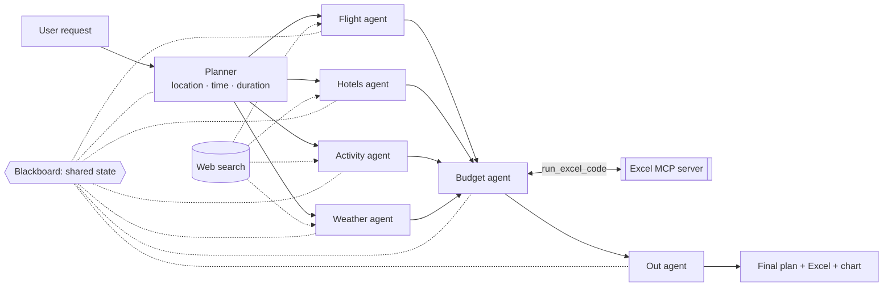

# ✈️ Multi-Agent Trip Planner

> Describe a trip in one sentence. Seven AI agents research flights, hotels, activities and weather **in parallel**, a budget agent crunches the costs and drives an **Excel MCP server** to build the spreadsheet and chart, and a final agent writes your plan.


*"7 days in Istanbul in October, 3 people, mid-range, love history and food. Flying from Cairo."* → day-by-day itinerary, flight and hotel picks, a budget table, an Excel file and a chart.

---

## Features

- **Natural-language input**: no forms; the planner extracts destination, dates, duration, travelers, style and interests.
- **Parallel agents**: flight, hotels, activity and weather agents run at the same time and search the web for current information.
- **Weather-aware itinerary**: the final plan reports typical temperatures and rain, suggests what to pack, and schedules outdoor and indoor activities accordingly.
- **Blackboard architecture**: all agents read and write one shared state, so each can build on the others' work.
- **MCP-powered budget**: the budget agent calls a separate [Excel MCP server](https://github.com/hagerhegazy/Excel-ai-analyst_MCP) to create `trip_budget.xlsx` and a cost chart.
- **Streamlit UI**: live progress per agent, the full plan, the chart, an Excel download button and a view of the blackboard.

## Architecture



Flight, hotels, activity and weather run in parallel. The budget agent waits for all four (fan-out / join in LangGraph), then the out agent reads the whole blackboard and writes the final plan.

## Tech stack

Python · LangGraph · LangChain · Groq (`openai/gpt-oss-120b`) · Model Context Protocol (MCP) · DuckDuckGo search · Streamlit · pandas / openpyxl / matplotlib (inside the MCP server)

## Project structure

```
├── app.py            # Streamlit UI
├── main.py           # CLI runner
├── planner.py        # request parsing + LangGraph wiring
├── blackboard.py     # shared state
├── llm.py            # Groq helpers (text, JSON, number cleanup)
├── mcp_client.py     # starts the Excel MCP server and loads its tools
├── agents/
│   ├── base.py       # shared search → LLM → JSON logic
│   ├── flight.py  hotels.py  activity.py  weather.py
│   ├── budget.py     # cost maths + MCP calls (Excel + chart)
│   └── out_agent.py  # final Markdown plan
├── tools/web_search.py
└── MCP/              # the Excel MCP server ([MCP excel expert](https://github.com/hagerhegazy/Excel-ai-analyst_MCP)
```

## Getting started

```bash
git clone https://github.com/<your-username>/<this-repo>.git
cd <this-repo>

# the Excel MCP server lives in its own repo; clone it into MCP/
git clone https://github.com/hagerhegazy/Excel-ai-analyst_MCP.git MCP

python -m venv .venv
.venv\Scripts\activate          # Windows  (source .venv/bin/activate on macOS/Linux)
pip install -r requirements.txt
pip install langchain-mcp-adapters mcp pandas openpyxl matplotlib

# add your key
echo GROQ_API_KEY=your_key > .env
echo GROQ_MODEL=openai/gpt-oss-120b >> .env

streamlit run app.py
```

Or from the terminal: `python main.py "5 days in Rome in November, 2 people, love food"`

## How the MCP connection works

`mcp_client.py` launches `MCP/task_server.py` as a subprocess over stdio and loads its `run_excel_code` tool. Only the **budget agent** receives that tool: it writes the pandas/openpyxl code for the workbook and the matplotlib code for the chart, and the MCP server executes it safely in its own process. The rest of the system never touches the MCP.
